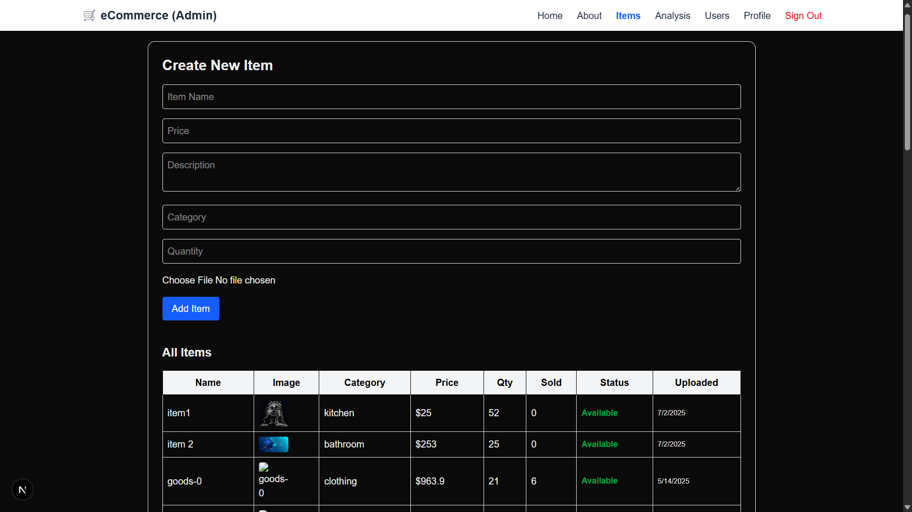
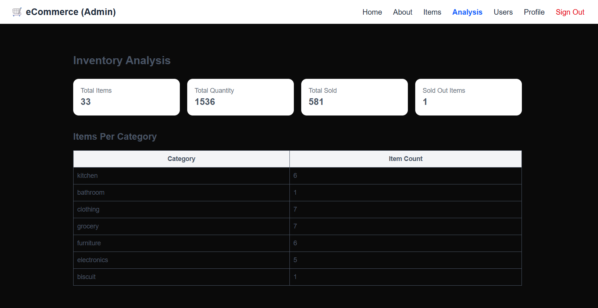
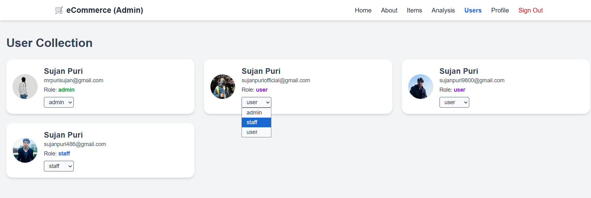

# 🛒 eCommerce Admin Dashboard

An AI-supported admin panel built with **Next.js**, **Express.js**, and **MongoDB**, designed to manage inventory, users, and performance analytics. The app includes secure Google OAuth login using NextAuth and supports cloud image uploads via Cloudinary.

## 🔐 Authentication

* Google OAuth using **NextAuth.js**
* Role-based access:

  * **Admin**: Full access to user and item management
  * **Staff**: Can add/manage items
  * **User**: View-only access

---

## ✨ Features

### 1. 🧾 Items Page

* Add items with: `name`, `price`, `description`, `category`, `image`, etc.
* Cloudinary image upload
* Auto-calculates sold-out status, sales/restock history
* View all items in a table format

📸 **Preview:**

---

### 2. 📊 Analysis Page

* Inventory analytics including:

  * Total items, quantities, and sales
  * Sold-out item count
  * Category-wise breakdown
* Ready for future chart integrations (bar, pie)

📸 **Preview:**

---

### 3. 👥 User Management Page (Admin Only)

* View all users
* Promote/demote roles between Admin/Staff/User
* Prevent unauthorized access to protected routes

📸 **Preview:**

---

### 4. 🙋‍♂️ User Profile Page

* Edit your name and photo
* View your email and role
* Protected route

📸 **Preview:**

---

## ⚙️ Tech Stack

* **Frontend**: Next.js 14 (App Router), TailwindCSS
* **Backend**: Express.js, MongoDB
* **Auth**: NextAuth (Google OAuth)
* **Cloud**: Cloudinary (for images)

what I learned: 
To clear all the local changes and go back to the point of previous commit (Push in git)
1. git reset --hard HEAD
2. git clean -fd
